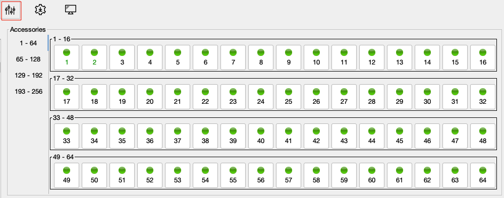
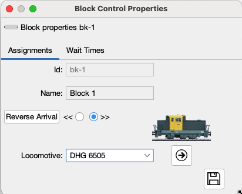
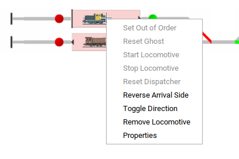
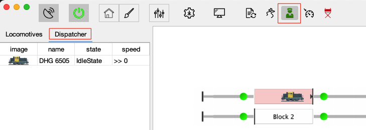

# Driving with JCS

- Manual
- Automatically

## Manual

For Manual Driving Loc Driver Cab Dialog is avaliable. This this Dialog a Locomotive can be controlled. Functions can be switched. Multipel dialog can be show simultanously.
The Locomotive Driver can be opened by double clicking on the locomotive of choice in locomotive list.

### Driver Cab

### Accessory Switching

Click in the toolbar on the "switch" button to show Accessory Keyboard

The Accessory buttons directly switch the address as shown on the Button.

## Automatic Driving

In the Home Screen click on a Block to set a locomotive in a Block. The first step is to place a locomotive on the track, both pysical as grapical ;)

For each block the wait times can be set.

When the __Always Stop__ checkbox is checked, a locomotive will stop and wait for the specified waiting time be for starting a new cycle. The Min. Wait Time is used in case the __Random Wait__ is not selected.

When the __Random Wait__ checkbox is checked a random time between the min and max wait time is used when a locomtive stops in the block.

When this pysical direction of the locomotive is different, it can be changed by either using:

- Reverse Arrival side
- Toggle Direction

By Right clicking on the block these menu options are available.

## Start Auto Pilot

The JCS AutoPilot is the automatic driving Algorithm within JCS.
AutoPilot is enabled by clicking the __*Pilot*__ button.
Every locomotive on track is assigned a Dispatcher. whic can be viewd in the Dispatcher List.

A Locomotive can by started by right click via the Block Menu or Start All by clicking on the __Cruise Control__ button.

When Auto drive start the Status of the dispatche is shown in the Dispatche list. Also the layou screen will show what is happening by shoing reserved routes and Block States.

