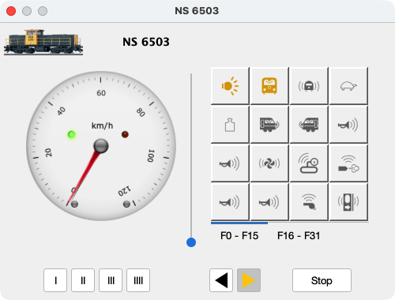

# Rijden met JCS

- Handmatig
- Automatisch

## Handmatig

Voor handmatig rijden is de Loc Driver Cab Dialoog beschikbaar. Met dit dialoogvenster kan een locomotief worden bediend. Functies kunnen worden in- en uitgeschakeld. Meerdere dialoogvensters kunnen tegelijkertijd worden weergegeven.
De Locomotiefbestuurder kan worden geopend door dubbel te klikken op de gewenste locomotief in de locomotieflijst.

### Bestuurderscabine

### Accessoires schakelen

Klik in de werkbalk op de "schakel"-knop om het Accessoiretoetsenbord weer te geven.

De knoppen van de accessoires schakelen direct het adres dat op de knop wordt weergegeven.

## Automatisch rijden

Klik op het beginscherm op een blok om een locomotief in een blok te plaatsen. De eerste stap is om een locomotief op het spoor te plaatsen, zowel fysiek als grafisch ;)

Voor elk blok kunnen de wachttijden worden ingesteld.

Wanneer het selectievakje __Altijd Stoppen__ is aangevinkt, zal een locomotief stoppen en wachten gedurende de opgegeven wachttijd voordat een nieuwe cyclus wordt gestart. De Min. Wachttijd wordt gebruikt als __Willekeurige Wacht__ niet is geselecteerd.

Wanneer het selectievakje __Willekeurige Wacht__ is aangevinkt, wordt een willekeurige tijd tussen de minimale en maximale wachttijd gebruikt wanneer een locomotief stopt in het blok.

Wanneer de fysieke richting van de locomotief anders is, kan deze worden aangepast door gebruik te maken van:

- Aankomstzijde omkeren
- Richting wisselen

Door met de rechtermuisknop op het blok te klikken, zijn deze menu-opties beschikbaar.

## AutoPilot starten

De JCS AutoPilot is het automatische rijd-algoritme binnen JCS.
AutoPilot wordt ingeschakeld door op de __*Pilot*__ knop te klikken.
Elke locomotief op het spoor krijgt een Dispatcher toegewezen, die kan worden bekeken in de Dispatcher-lijst.

Een locomotief kan worden gestart door met de rechtermuisknop via het Blokmenu te klikken of Start Alles door op de __Cruise Control__ knop te klikken.

Wanneer het automatisch rijden wordt gestart, wordt de status van de dispatcher weergegeven in de Dispatcher-lijst. Ook wordt op het baanoverzichtsscherm getoond wat er gebeurt door gereserveerde routes en blokstaten weer te geven.

