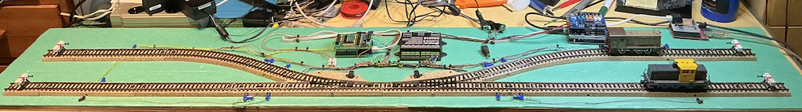
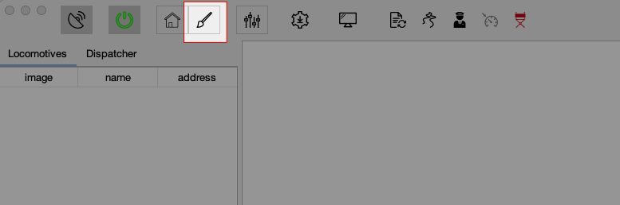
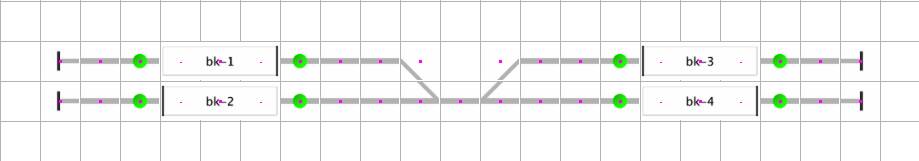
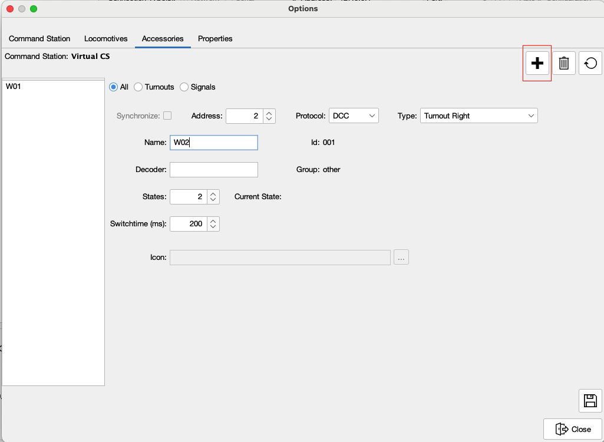
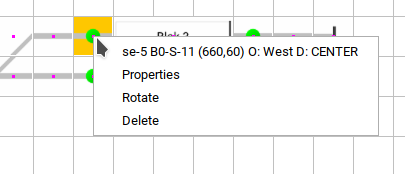
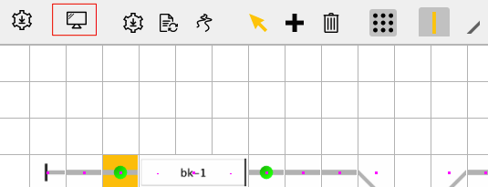
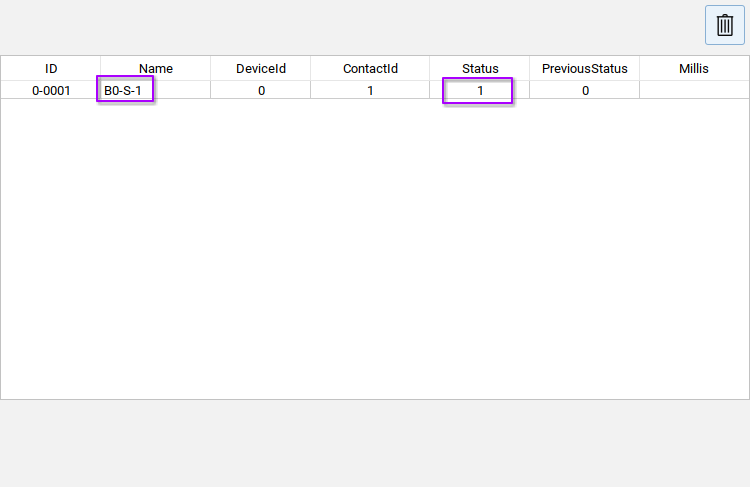
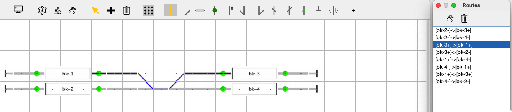

# JCS Quick Setup Guide

***

## Get Started driving your Trains automatically

This guide explains how to configure JCS for a layout and automatically run trains.
For the purpose of this guide the following Layout is used.

This layout consist out of 4 blocks and 2 switches.
Every block has 2 sensors, in total there are 8 sensors used.
What is a Block? A block is a part of track where one train can be without hindering other routes. In JCS a block is always demarcated by two sensors.

## Drawing the Layout

When JCS is started select the Edit Button to enable edit mode.

JCS will show the Edit Layout Screen

The Toolbar has the most common elements to draw a layout. A layout consist out of tiles. A Tile mimics a component like a straight, sensor, block etc.
Use the __+__ button to add a tile on the canvas. The Bin button will delete a tile.
Rightclick on a tile to see properties or rotate or flip if applicable.
When a tile is selected it can be dragged to the right position. Tiles are automatically saved. The example looks like this when all tiles are placed on the canvas.

## Pysical vs schematic Layout

The below picure shows the physical layout side by side with the schematic layout.

### Configuring Accessories and Sensors

The next step is to configure the Accessories and Sensors.
Accessories, Sensors and Locomotives are always linked to a Command Station.

#### Step 1 selecting the Default Command Station

For this guide the [DCC-EX](https://dcc-ex.com) Command Station is used. Feedback via [DCC-EX](https://dcc-ex.com) is not yet supported, see [issue 59](https://github.com/fransjacobs/model-railway/issues/59), hence the [HSI-S88](https://www.ldt-infocenter.com/dokuwiki/doku.php?id=en:hsi-88-usb) is used for Sensor feedback.
Use the cog button or via Menu -> Tools Command Stations to show the Command Station Dialog.

Use the Refresh button on the right side of the Serialport dropdown menu to refresh
connected serial ports. In this example the [DCC-EX](https://dcc-ex.com) is connected via the "ttyACM0" port.

Set the [DCC-EX](https://dcc-ex.com) Command Station as __Default__ and __Enabled__.
The Test Button can be used to check whether the connection can be established.

##### Setup the Feedback module(s)

In the Command Station Dialog select the [HSI-S88](https://www.ldt-infocenter.com/dokuwiki/doku.php?id=en:hsi-88-usb) in the Command Stations dropdown menu.

Do __*NOT*__ set the [HSI-S88](https://www.ldt-infocenter.com/dokuwiki/doku.php?id=en:hsi-88-usb) as *Default*, as the default Command Station is supposed to put the power on the Track.
However set the [HSI-S88](https://www.ldt-infocenter.com/dokuwiki/doku.php?id=en:hsi-88-usb) __Enabled__. The [HSI-S88](https://www.ldt-infocenter.com/dokuwiki/doku.php?id=en:hsi-88-usb) is connected via the "ttyACM1" port.

For the Feedback Interface like the [HSI-S88](https://www.ldt-infocenter.com/dokuwiki/doku.php?id=en:hsi-88-usb) the number of connected S88 modules has to be specified. Set the Channel to which the S88 module(s) is/are connected and the number of Modules.
In this case one S88 module, connected to Channel 0 is used.
Click on __*Re-create Sensors*__ button to create the sensors in the system.

### Step 2 create Accessories

The Test track has two turnouts which can be added using the Accessory Dialog. This Dialog can be opened via Settings (Mac) or Menu -> Tools -> Options.
To Add a new Accessory click on the __+__ button. For a Turnout choose the right Turnout type in the __*Type*__ dropdown menu.

To save the Accessory click the Save Button. When save the Accessory will appear in the list on the left side. This List can be filtered using the 3 radio buttons on top (All, Turnouts, Signals).

### Step 3 add Locomotives

As we are in the options Dialog let's also add the Locomotives. In this Example two locomotives used. For both locomotives an icon is already put in a subdirectory .../jcs/images.

Locomotives can only commute back and forth, hence the __Commuter__ check box is selected for both locomotives. If the __Commuter__ checkbox not selected the Locomotice can __*NOT*__ change direction in Automatic mode.

### Step 4 Link sensors to their graphical representation

JCS "knows" where a locomotive is by monitoring the sensors on the track. Every sensor has to be linked to the location in the schematic layout. As already mentioned a block allways needs two sensors. When a train arrives in a block (enter) the enter sensor detects this. When the train reaches the destination, a.k.a. is fully in the block, this is detected by the occupation (in) sensor.
When a sensor is active JCS will "see" this as occupied and in automatice mode will not plot a route to this block.
To link a Sensor, right click on a sensor.

Click on Properties and select the pysical sensor.

If you do no exactly know which sensor is at this location, you can use the Sensor Monitor. Click on the Sensor Monitor button to activate.

The Sensor Monitor will appear. When the sensor is activated (pre condition is that the HSI-S88 is connected), it will be visible in the Sensor Monitor as active.

Select the Sensor with the right name in Sensor Properties dialog. Repeat this for all sensors in the layout.

### Step 5 Link Accessories to the pycisl ones

Like the Sensor also accessories __must__ be linke to their pysical counterpart.
Right click on the Accessory and select properties.

### Step 6 Trace the layout

Trace the layout. This will generate all the driveways from block to block. Click on the __*Trace*__ button.

Left of the Main JCS Window the Routes Dialog will Appear.
Click in the __*Trace*__ Button in the *Routes Dialog* to generate all possible routes.

When a route is selected in the list it is displayed in the main screen.

### Step 7 Configure the Blocks

Configure the Block properties. For every Block a name __must__ be filled in. Sensors must be linked to a block. The side of the Block with the __Bold__ line is the __+__ (plus) side of the Block. The Sensors can be automatically linked by using the __*Auto Link*__ Button.
Notice: when the Sensors do not link to the block, the sensors are usually not linked to a pysical sensor.

After all these settings are done a restart of JCS is strongly advised.

## Driving

[DRIVING](DRIVING.md)