# JCS Snelle Installatiehandleiding

***

## Begin met het automatisch laten rijden van je treinen

Deze handleiding legt uit hoe je JCS configureert voor een modelbaan en treinen automatisch laat rijden.
Voor deze handleiding wordt de volgende modelbaan gebruikt.

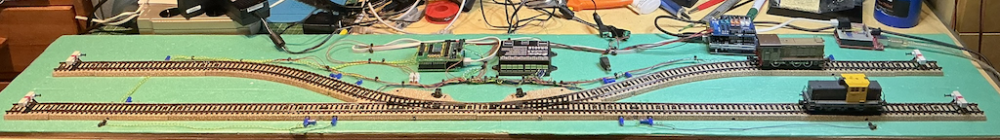

Deze baan bestaat uit 4 blokken en 2 wissels.
Elk blok heeft 2 sensoren, in totaal worden er 8 sensoren gebruikt.
Wat is een blok?
Een blok is een deel van het spoor waar één trein kan staan zonder andere routes te hinderen.
In JCS wordt een blok altijd gemarkeerd door twee sensoren.

## Het tekenen van de baan

Wanneer JCS is gestart, selecteer je de Bewerken-knop om de bewerkingsmodus te activeren.
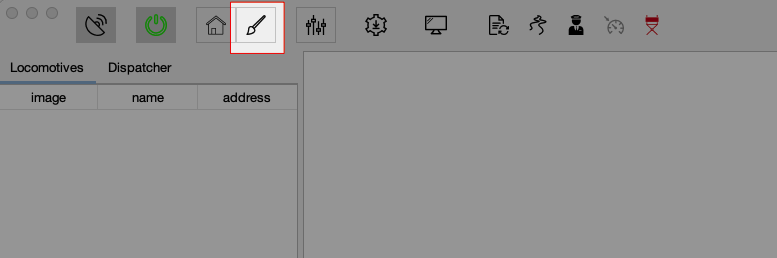 Via toesenbord door Ctrl + E.

JCS toont het scherm voor het bewerken van de baan.
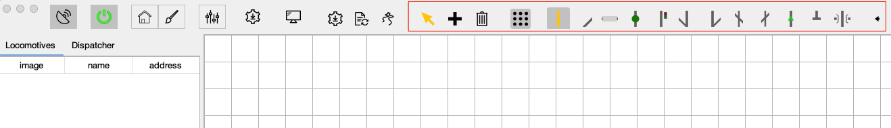

De werkbalk bevat de meest voorkomende elementen om een baan te tekenen. Een plattegrond van een baan bestaat uit tegels.
Een tegel stelt een component, zoals een recht stuk, sensor, blok, enz. voor.
Gebruik de __+__ knop, of via toetsenbord Alt + A om een tegel op het canvas toe te voegen. De prullenbakknop (Alt +D) verwijdert een tegel.
Klik met de rechtermuisknop op een tegel om eigenschappen te bekijken of de tegel te draaien (Alt + R) of om te keren (Alt + H of Alt + V),
indien van toepassing. Wanneer een tegel is geselecteerd, kan deze naar de juiste positie worden gesleept.
Tegels worden automatisch opgeslagen.
Het voorbeeld ziet er als volgt uit wanneer alle tegels op het canvas zijn geplaatst.

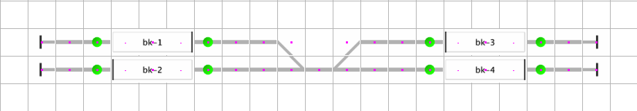

## Fysieke vs. schematische baan

De onderstaande afbeelding toont de fysieke baan naast de schematische baan.

### Het configureren van accessoires en sensoren

De volgende stap is het configureren van de accessoires en sensoren.
Accessoires, sensoren en locomotieven zijn altijd gekoppeld aan een command station.

#### Stap 1: Het selecteren van het standaard command station

Voor deze handleiding wordt het[DCC-EX](https://dcc-ex.com) Command Station gebruikt.
Terugmelding via [DCC-EX](https://dcc-ex.com) wordt nog niet ondersteund,
zie [issue 59](https://github.com/fransjacobs/model-railway/issues/59),
daarom wordt de [HSI-S88](https://www.ldt-infocenter.com/dokuwiki/doku.php?id=en:hsi-88-usb) gebruikt voor sensorfeedback.
Gebruik de tandwielknop of ga naar Menu -> Tools -> Command Stations om het Command Station Dialoogvenster weer te geven.

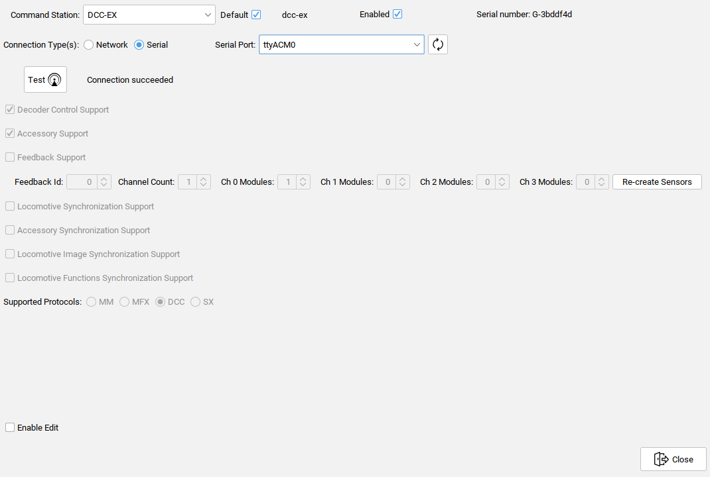

Gebruik de Vernieuw-knop aan de rechterkant van het dropdownmenu van de seriële poort om de verbonden seriële poorten te vernieuwen.
In dit voorbeeld is de [DCC-EX](https://dcc-ex.com) verbonden via de "ttyACM0" poort.

Stel het [DCC-EX](https://dcc-ex.com) Command Station in als __Standaard__ en __Ingeschakeld__.
De Testknop kan worden gebruikt om te controleren of de verbinding kan worden gemaakt.

##### Het instellen van het feedbackmodule(s)

In het Command Station-dialoogvenster selecteer je de [HSI-S88](https://www.ldt-infocenter.com/dokuwiki/doku.php?id=en:hsi-88-usb) in het dropdownmenu Command Stations.

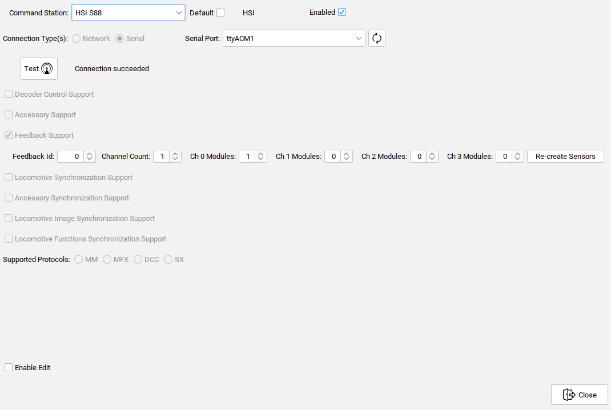

Stel de [HSI-S88](https://www.ldt-infocenter.com/dokuwiki/doku.php?id=en:hsi-88-usb) __*NIET*__ in als Standaard, aangezien het standaard command station bedoeld is om de stroom op het spoor te zetten.
Stel echter de [HSI-S88](https://www.ldt-infocenter.com/dokuwiki/doku.php?id=en:hsi-88-usb) in op Ingeschakeld.
De [HSI-S88](https://www.ldt-infocenter.com/dokuwiki/doku.php?id=en:hsi-88-usb) is verbonden via de "ttyACM1" poort.

Voor de feedbackinterface, zoals de [HSI-S88](https://www.ldt-infocenter.com/dokuwiki/doku.php?id=en:hsi-88-usb) moet het aantal aangesloten S88-modules worden opgegeven.
Stel het kanaal in waarop de S88-module(s) zijn aangesloten en het aantal modules.
In dit geval wordt één S88-module gebruikt, aangesloten op Kanaal 0. Klik op de knop __Hercreëer sensoren__ om de sensoren in het systeem te maken.

### Step 2 Accessoires aanmaken

De testbaan heeft twee wissels die kunnen worden toegevoegd via het Accessoires-dialoogvenster.
Dit venster kan worden geopend via Instellingen (Mac) of Menu -> Tools -> Opties. Om een nieuw accessoire toe te voegen, klik je op de __+__ knop. Voor een wissel kies je het juiste wisseltype in het __Type__ dropdownmenu.

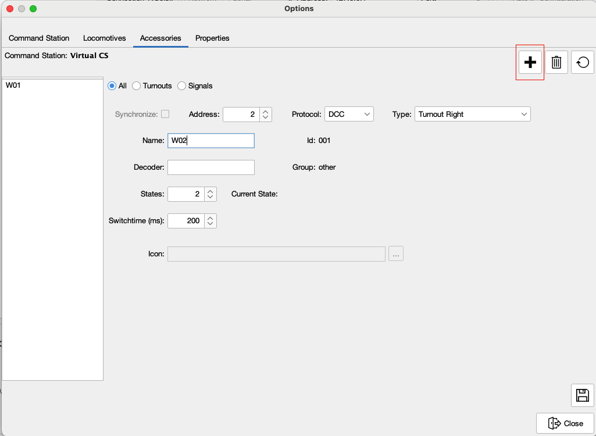

Om het accessoire op te slaan, klik je op de Opslaan-knop.
Wanneer het accessoire is opgeslagen, verschijnt het in de lijst aan de linkerkant.
Deze lijst kan worden gefilterd met de 3 radioknoppen bovenaan (Alle, Wissels, Signaleringen).

### Step 3 Locomotieven toevoegen

Aangezien we in het Opties-dialoogvenster zijn, laten we ook de locomotieven toevoegen.
In dit voorbeeld worden twee locomotieven gebruikt.
Voor beide locomotieven is een pictogram al geplaatst in een submap .../jcs/images.

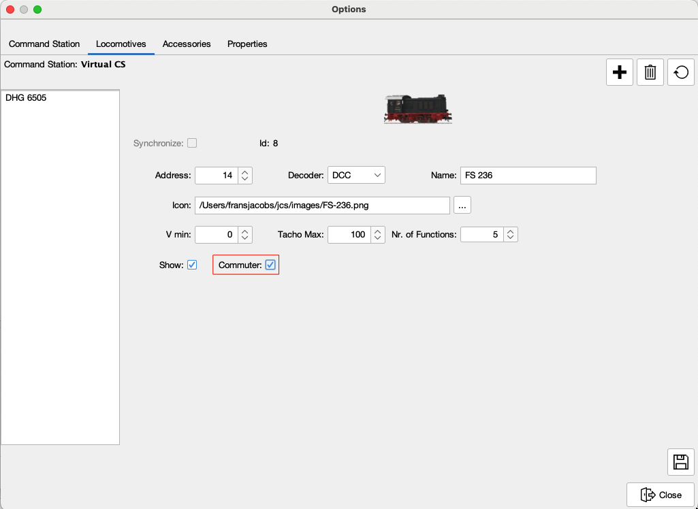

Locomotieven kunnen alleen heen en weer pendelen, daarom is het selectievakje __Pendelen__ geselecteerd voor beide locomotieven.
Als het __Pendelen__ selectievakje niet is geselecteerd, kan de locomotief __*NIET*__ van richting veranderen in de automatische modus.

### Step 4 Sensoren koppelen aan hun grafische weergave

JCS "weet" waar een locomotief zich bevindt door de sensoren op de baan te monitoren.
Elke sensor moet worden gekoppeld aan de locatie in de schematische baan.
Zoals eerder vermeld, heeft elk blok altijd twee sensoren.
Wanneer een trein een blok binnenkomt (enter), detecteert de binnenkomstsensor dit.
Wanneer de trein de bestemming bereikt, oftewel volledig in het blok staat, wordt dit gedetecteerd door de bezettingssensor (in).
Wanneer een sensor actief is, ziet JCS dit als bezet en zal in de automatische modus geen route naar dit blok worden uitgestippeld.
Om een sensor te koppelen, klik je met de rechtermuisknop op een sensor.

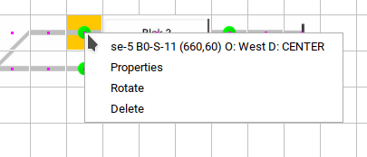

Klik op Eigenschappen en selecteer de fysieke sensor.

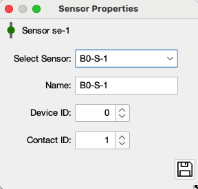

Als je niet precies weet welke sensor zich op deze locatie bevindt, kun je de Sensor Monitor gebruiken.
Klik op de Sensor Monitor-knop om deze te activeren.

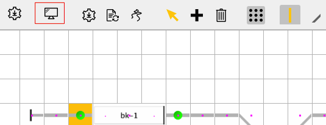

De Sensor Monitor verschijnt. Wanneer de sensor wordt geactiveerd (voorwaarde is dat de HSI-S88 is verbonden), wordt dit zichtbaar in de Sensor Monitor als actief.

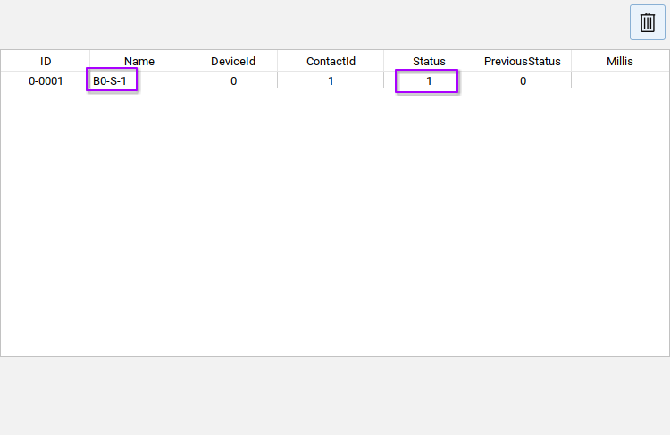

Selecteer de juiste sensor in het Sensor Eigenschappen-dialoogvenster. Herhaal dit voor alle sensoren in de baan.

### Step 5 Accessoires koppelen aan de fysieke exemplaren

Net als bij de sensoren __moeten__ accessoires gekoppeld worden aan hun fysieke tegenhanger.
Klik met de rechtermuisknop op het accessoire en selecteer Eigenschappen.

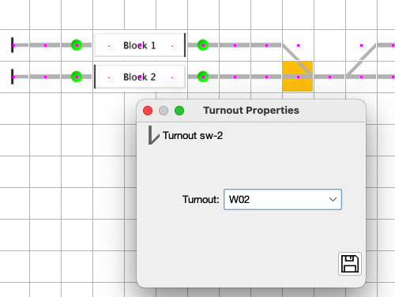

### Step 6 Het baanplan traceren

Traceer het baanplan. Dit genereert alle rijwegen van blok naar blok. Klik op de __*Traceer*__ knop.

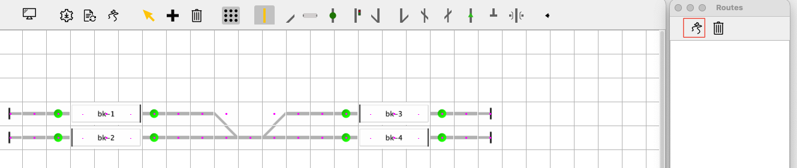

Links van het hoofdvenster van JCS verschijnt het Rijwegen-dialoogvenster.
Klik op de __*Traceer*__ knop in het Rijwegen-dialoogvenster om alle mogelijke routes te genereren.

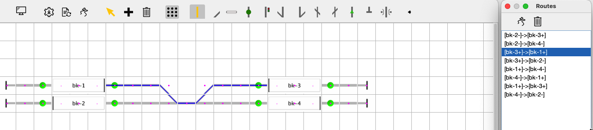

Wanneer een route is geselecteerd in de lijst, wordt deze weergegeven op het hoofdscherm.

### Step 7 De blokken configureren

Configureer de blokkeneigenschappen. Voor elk blok moet een naam worden ingevuld.
Sensoren moeten aan een blok worden gekoppeld.
De kant van het blok met de Vette lijn is de __+__ (plus) kant van het blok.
De sensoren kunnen automatisch worden gekoppeld door de knop __*Auto Link*__ te gebruiken.
*Opmerking*: wanneer de sensoren niet aan het blok worden gekoppeld, zijn de sensoren meestal niet gekoppeld aan een fysieke sensor.

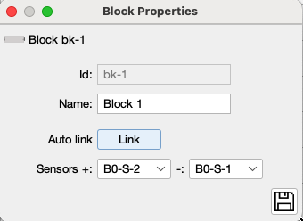

Na het voltooien van al deze instellingen wordt een herstart van JCS sterk aanbevolen.

## Rijden

[DRIVING](DRIVING_NL.md)