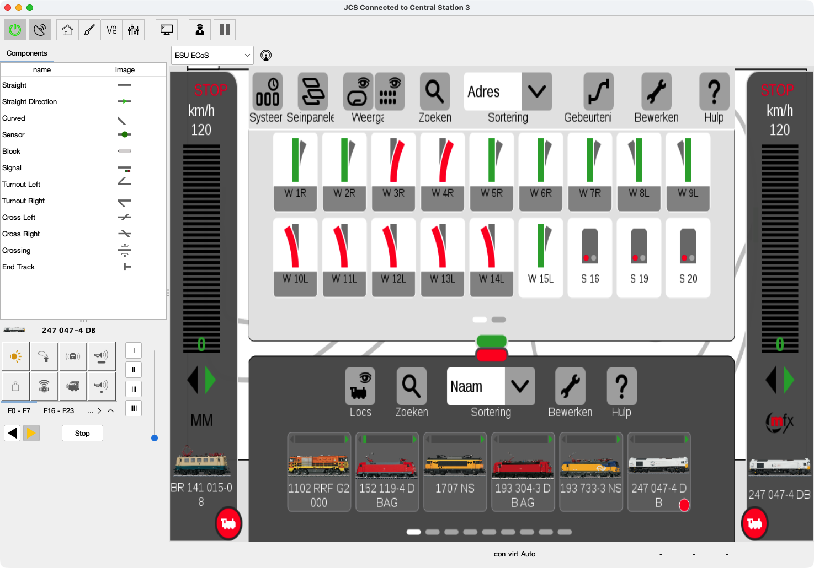

# JCS - Java Central Station

🌐 **[Read this README in english](README.md)**

🎯 *Een open source project voor modelspoor automatisering.*

  
  
  
  
  

## 🚂 Over

JCS, Java Central Station, is een open source project om een modelspoorbaan tot leven te brengen met software.  

Ik ben dit project begonnen uit nieuwsgierigheid (en plezier!),
om te ontdekken hoe ver ik automatisering op een modelspoorbaan kon brengen,
zonder afhankelijk te zijn van gesloten, commerciële systemen.

Inmiddels is het uitgegroeid tot een volledige tool die:

- een layout tekenen, en treinen laten rijden met *handmatige* of *automatische* bediening.
- Werkt met centrales zoals de Märklin CS2/CS3, ESU ECoS, DCC-EX en HSI-S88.  
- Je de mogelijkheid geeft om in Autopilot-modus te rijden of handmatig met de Driver Cab.  
- Live feedback van sensoren en wissels op je layout toont.  
- Een Virtueel Command Station bevat, zodat je ook zonder hardware kunt experimenteren.  
- een "op afstand" scherm voor centrales die VNC onder steunen

Het doel is niet om te concurreren met professionele producten, maar om iets open, uitbreidbaar en gemakkelijk te bedienen te creëren, — voor iedereen die graag met treinen en code knutselt. 🚉✨

## 🎯 Waarom dit project?

De meeste commerciële oplossingen voor modelspoorautomatisering voelen als een **black box** — met (heel) veel functionaliteit, maar gesloten, star en overkill voor mijn hobby-layout(s).  

Ik begon **JCS** omdat ik iets anders wilde:  

- Een project waar ik kon **leren door te bouwen**.  
- Een kans om **vrij te experimenteren** met nieuwe ideeën.  
- En bovenal… om **plezier te hebben met het rijden van treinen**! 🚂✨  

Door JCS open source te maken, hoop ik ook andere hobbyisten te inspireren:  

- Knutselaars die onder de motorkap willen kijken.  
- Bouwers die het willen uitbreiden met hun eigen functies.  
- Of gewoon iedereen die een gratis en flexibele oplossing zoekt voor hun layout.  

## ✨ Belangrijkste functies

- **Verbinding met centrales**: Märklin CS2/CS3, ESU ECoS, DCC-EX en HSI-S88.  
- **Teken je layout**: Een interactieve grafische editor om sporen, blokken en sensoren te ontwerpen.  
- **Automatisch treinen laten rijden**: Laat de Autopilot routing en blokbeheer regelen.  
- **Of bestuur ze zelf**: Gebruik de ingebouwde Throttle / Driver Cab voor handmatige controle.  
- **Live overzicht**: Zie realtime feedback van sensoren, wissels en blokken.  
- **Test zonder hardware**: Het Virtuele Command Station laat je op het scherm experimenteren.  
- **Externe toegang**: Ingebouwde VNC-viewer voor Märklin CS3 en ESU ECoS systemen.  

> Of je de bediening nu aan Autopilot wilt overlaten, of zelf de controle houdt, JCS laat je layout tot leven komen.

## 🖼️ Screenshots

### Hoofd scherm

### Spoorplan editor

### (terug) Melder monitor

### Locomotief besturings dialoog

### Hoofdschem met VNC naar Marklin CS-3

### Centrale instellingen voor Marklin CS-3
 

## ⚙️ Ondersteunde Centrales

JCS ondersteunt een reeks populaire centrales voor zowel commerciële als DIY-opstellingen:

- **[Märklin CS-3](https://www.marklin.nl/producten/details/article/60216)**  
  Volledig ondersteund; biedt volledige controle over locomotieven, wissels en accessoires.

- **[Märklin CS-2](https://www.marklin.nl/producten/details/article/60215)** — [Protocol Documentatie](http://streaming.maerklin.de/public-media/cs2/cs2CAN-Protokoll-2_0.pdf)  
  Ondersteund via CAN-bus; kan gebruikt worden voor realtime feedback en handmatig rijden.

- **[ESU ECoS](https://www.esu.eu/)** — [Protocol Documentatie ESU](https://github.com/cbries/railessentials/blob/master/ecoslibNet48/Documentation/ecos_pc_interface3.pdf) — [Community Versie](https://github.com/TabalugaDrache/TCPEcos/files/13458970/Netzwerkspezifikation_2023.pdf)  
  Ondersteunt TCP/IP-verbindingen; compatibel met zowel commerciële als community-protocollen.

- **[DCC-EX](https://dcc-ex.com)**  
  Kan worden verbonden via seriële poort of netwerk; biedt volledige DCC-controle voor locomotieven, blokken en accessoires.

- **[HSI-S88](https://www.ldt-infocenter.com/dokuwiki/doku.php?id=en:hsi-88-usb)** — of de [DIY-versie](https://mobatron.4lima.de/2020/05/s88-scanner-mit-arduino)  
  Feedbackmodule voor bloksensornetwerken; ondersteunt zowel officiële als zelfgebouwde oplossingen om treinbezetting te detecteren.

## 🔧 Huidige status & Roadmap

JCS is in actieve ontwikkeling! Je kunt voortgang volgen, issues melden of functies voorstellen op de [GitHub Issues pagina](https://github.com/fransjacobs/model-railway/issues).  

Huidige focusgebieden:

- Documentatie verbeteren  
- GUI verbeteren  
- Signaalweergave toevoegen bij automatisch rijden  
- Internationalisatie (meertalige ondersteuning)  
- Uitbreiden van unit tests  
- Meer hardware-integraties  

## 🎮 Wil je het zelf proberen?

Als je JCS zelf wilt uitproberen, wordt dat zeer gewaardeerd!  

Voordat je begint, zorg ervoor dat je layout aan een paar eisen voldoet:

- Elk blok moet **ten minste 2 feedbacksensoren** hebben.  
- Een **wissel** mag geen onderdeel zijn van een blok.  
- Je layout moet **minimaal 2 blokken** bevatten.  

Zodra je layout klaar is, kun je beginnen met het verkennen van Autopilot en handmatig rijden met de Driver Cab.

### 🛠 Vereisten

Voordat je JCS start, zorg ervoor dat je het volgende hebt:

- **Java 21** geïnstalleerd (bijv. [Temurin OpenJDK](https://adoptium.net/temurin/releases/))  
- Een **ondersteund commandostation** verbonden en geconfigureerd (zie [Ondersteunde Commandostations](#ondersteunde-commandostations))  

> Tip: Zorg dat je Java-omgeving correct in je systeem-PATH staat om de applicatie via de command line te kunnen starten.

### 💾 Download een Prebuilt Release

De nieuwste stabiele versie is **v0.0.2** (uitgebracht op 27 september 2024):  

- Eerste volledig geautomatiseerde rijversie  
- Uitvoerbare bestanden voor **Windows, macOS, Linux** en een **cross-platform Uber-JAR**  
- Voor volledige release-notes en changelog, zie de [Releases sectie](https://github.com/fransjacobs/model-railway/releases)  

> Tip: De Uber-JAR kan direct gestart worden met `java -jar jcs-uber.jar` zonder extra dependencies.

### 🏗 Bouw vanaf de bron code

Als je JCS liever zelf bouwt:  

- Zie [BUILDING.md](BUILDING.md) voor **volledige build-instructies**, inclusief benodigde libraries, Maven-commando’s en troubleshooting tips.  
- Aanbevolen voor ontwikkelaars die de applicatie willen **aanpassen, uitbreiden of debuggen**.  

### ⚙️ Setup en Gebruik

Begin snel met JCS met de volgende bronnen:

- **Walkthrough**: [JCS_SETUP_NL.md](JCS_SETUP_NL.md) — Stapsgewijze instructies voor het klaarzetten van je layout en starten van de applicatie.  
- **Rijden en Automatisering Gids**: [DRIVING_NL.md](DRIVING_NL.md) — Leer treinen handmatig of met Autopilot te besturen.  
- **Interface Documentatie**: [INTERFACES.md](INTERFACES.md) — Gedetailleerde info over het aansluiten van commandostations, sensoren en blokken.  

> Tip: Begin met een kleine layout en een paar treinen om functies te ontdekken voordat je opschaalt naar grotere layouts.

## 🤝 Bijdragen

Bijdragen zijn **altijd welkom**! Je kunt helpen door:

- Bugs of issues te melden op de [GitHub Issues pagina](https://github.com/fransjacobs/model-railway/issues)  
- Nieuwe functies of verbeteringen voor te stellen  
- Pull requests in te dienen met fixes of uitbreidingen 
- Chat of email
- Kop koffie 

Jouw input helpt JCS beter te maken voor iedereen.  

## 📄 Licentie

Dit project is gelicentieerd onder de **Apache-2.0 Licentie**.  
Zie het [LICENSE](LICENSE) bestand voor volledige details.  

## 🙌 Bijdragers

Heel veel dank aan iedereen die dit project ondersteunt!  

<table>
<tr>
    <td align="center">
        
         
        Steun de ontwikkeling en houd de treinen rijdend!
    </td>
</tr>
</table>

Ik hoop dat dit project je inspireert om **te experimenteren, knutselen en plezier te hebben met modeltreinen en code!**  

## 📜 Copyright 2018 - 2025 Frans Jacobs

Hierbij wordt gratis toestemming verleend aan iedereen die een kopie van deze software en bijbehorende documentatiebestanden (de "Software") verkrijgt om te werken met de Software **zonder enige beperking**, inclusief de rechten om te gebruiken, kopiëren, wijzigen, samenvoegen, publiceren, distribueren, sublicentiëren en/of verkopen van kopieën van de Software, en om personen aan wie de Software wordt verstrekt dit te doen, onder de volgende voorwaarden:

Bovenstaande copyrightvermelding en deze toestemming dienen te worden opgenomen in alle kopieën of substantieel delen van de Software.

**DE SOFTWARE WORDT GELEVERD "AS IS", ZONDER ENIGE GARANTIE**, expliciet of impliciet, inclusief maar niet beperkt tot de garanties van verkoopbaarheid, geschiktheid voor een bepaald doel en niet-inbreuk. In geen geval zijn de auteurs of copyrighthouders aansprakelijk voor enige claim, schade of andere aansprakelijkheid, hetzij in een contractuele actie, onrechtmatige daad of anderszins, voortvloeiend uit of in verband met het gebruik van de Software.

> Bedankt dat je deel uitmaakt van de JCS-community — elke bijdrage, suggestie of kop koffie houdt dit hobbyproject in leven! 🚂✨
