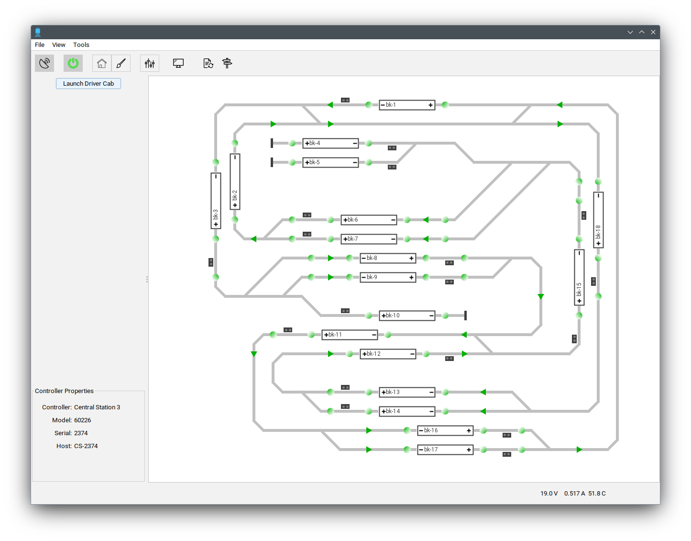
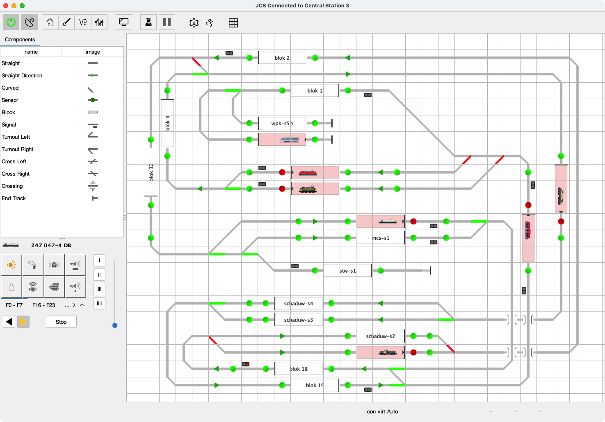
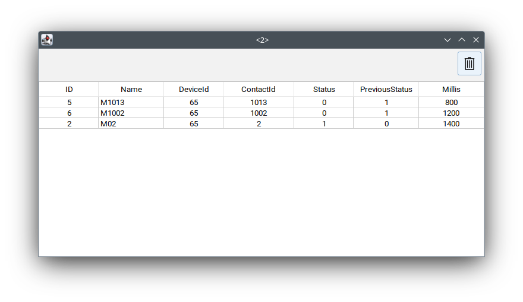
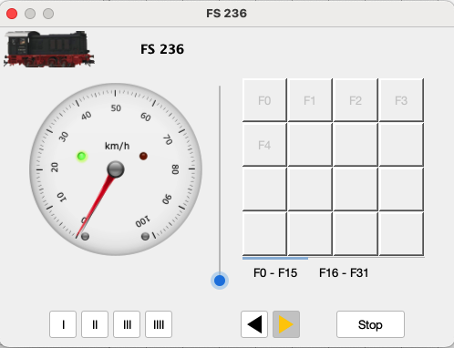
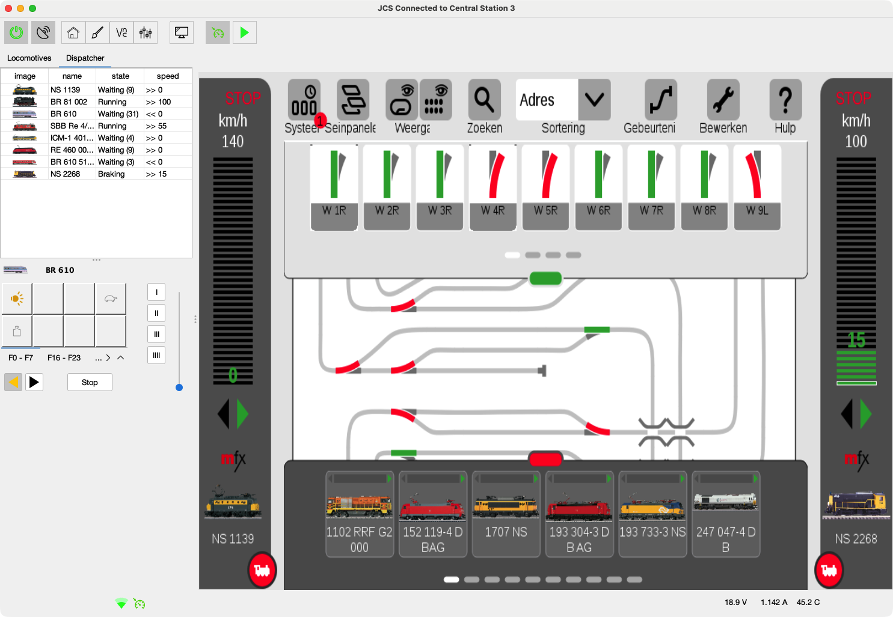
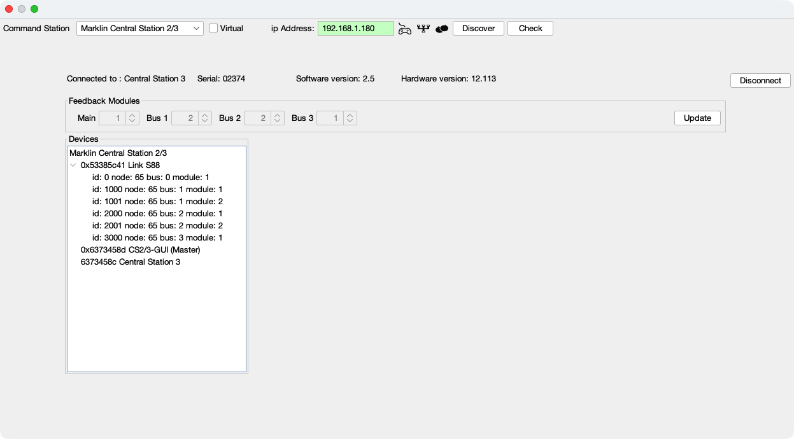

# JCS - Java Central Station

🌐 **[Lees deze README in het Nederlands](LEESMIJ.md)**

🎯 *An open-source project for model railway automation.*

  
  
  
  
  

## 🚂 About

JCS, Java Central Station, is an *open-source* project that brings a model railway to life with software.  

I started this project out of curiosity, to learn, and to have fun,
to discover how far I could take automation on a model railway,
without depending on closed, commercial systems.

It has since grown into a complete application that lets you:

- Draw a layout and run trains using *manual* or *automatic* control.
- Works with command stations such as Märklin CS2/CS3, ESU ECoS, Uhlenbrock Intellibox2, DCC-EX, and HSI-S88.  
- Lets you run trains in Autopilot mode or control them manually using the Driver Cab.  
- Shows live feedback from sensors and turnouts on your layout.  
- Includes a Virtual Command Station, so you can experiment even without hardware.  
- Provides a remote screen for command stations that support VNC.

The goal is not to compete with professional products, but to create something *open*, extensible, and easy to use — for anyone who enjoys tinkering with trains and code. 🚉✨

## 📄 User manual
The [User Manual](https://github.com/fransjacobs/model-railway/wiki) has been added to the Wiki.

## 🎯 Why this project?

Most commercial model railway automation solutions feel like a **black box** — with a great deal of functionality, but closed, rigid, and overkill for my hobby layout(s).  

I started **JCS** because I wanted something different:  

- A project where I could **learn by building**.  
- An opportunity to **experiment freely** with new ideas.  
- And above all… to **have fun running trains**! 🚂✨  

By making JCS *open source*, I also hope to **inspire** other hobbyists:  

- Tinkerers who want to look under the hood.  
- Builders who want to extend it with their own features.  
- Or simply anyone looking for a free and flexible solution for their model railway.  

## ✨ Key features

- **Command station connectivity**: Märklin CS2/CS3, ESU ECoS, Uhlenbrock Intellibox2 (LocoNet), DCC-EX, and HSI-S88.  
- **Draw your layout**: An interactive graphical editor for designing tracks, blocks, and sensors.  
- **Run trains automatically**: Let Autopilot handle routing and block management.  
- **Or control them yourself**: Use the built-in Throttle / Driver Cab for manual control.  
- **Live overview**: See real-time feedback from sensors, turnouts, signals, and blocks.  
- **Test without hardware**: The Virtual Command Station lets you experiment on screen.  
- **Remote access**: Built-in VNC viewer for Märklin CS3 and ESU ECoS systems.  

> Whether you want to leave control to Autopilot or stay in control yourself, JCS brings your model railway to life!

## 🖼️ Screenshots

### Main screen

### Track layout editor

### Feedback sensor monitor

### Locomotive control dialog

### Main screen with VNC to Märklin CS3

### Command station settings for Märklin CS3
 

## ⚙️ Supported command stations

JCS supports a range of popular command stations for both commercial and DIY setups:

- **[Märklin CS-3](https://www.marklin.nl/producten/details/article/60216)**  

- **[Märklin CS-2](https://www.marklin.nl/producten/details/article/60215)** — [Protocol Documentation](http://streaming.maerklin.de/public-media/cs2/cs2CAN-Protokoll-2_0.pdf)  

- **[ESU ECoS](https://www.esu.eu/)** — [Protocol Documentation ESU](https://github.com/cbries/railessentials/blob/master/ecoslibNet48/Documentation/ecos_pc_interface3.pdf) — [Community Version](https://github.com/TabalugaDrache/TCPEcos/files/13458970/Netzwerkspezifikation_2023.pdf)  

- **[Uhlenbrock Intellibox2](https://www.uhlenbrock.de/de_DE/produkte/prodarch/I1F5AE2E-001.htm!ArcEntryInfo=0004.61.I1F5AE2E)** — [Protocol Documentation](https://www.digitrax.com/support/loconet/loconetpersonaledition.pdf) 

- **[DCC-EX](https://dcc-ex.com)**  

- **[HSI-S88](https://www.ldt-infocenter.com/dokuwiki/doku.php?id=en:hsi-88-usb)** — or the [DIY version](https://mobatron.4lima.de/2020/05/s88-scanner-mit-arduino)  

## 🔧 Current status & roadmap

JCS is under active development! You can follow progress, report issues, or suggest features on the [GitHub Issues page](https://github.com/fransjacobs/model-railway/issues).  

Current focus areas:

- Improve documentation  
- Improve the GUI  
- Internationalization (multilingual support)  
- Expand unit tests  
- More hardware integrations  

## 🎮 Want to try it yourself?

If you would like to try JCS yourself, that is greatly appreciated!  

Before you begin, make sure your layout meets a few requirements:

- Each block must have **at least 2 feedback sensors**.  
- A **turnout** must not be part of a block.  
- Your layout must contain **at least 2 blocks**.  

Once your layout is ready, you can start exploring Autopilot and manual driving with the Driver Cab.

### 🛠 Requirements

Before starting JCS, make sure you have the following:

- **Java 25** installed (for example, [Temurin OpenJDK](https://adoptium.net/temurin/releases/))  
- A **supported command station** connected and configured (see [Supported Command Stations](#supported-command-stations))  

> Tip: Make sure your Java environment is correctly configured in your system PATH so you can start the application from the command line.

### 💾 Download a prebuilt release

The latest stable version is **v0.0.3** (released on November 24, 2025):  

- First fully automated train-running release  
- Executable files for **Windows, macOS, Linux**, plus a **cross-platform Uber-JAR**  
- For complete release notes and the changelog, see the [Releases section](https://github.com/fransjacobs/model-railway/releases)  

> Tip: The Uber-JAR can be started directly with `java -jar jcs-uber.jar` without additional dependencies.

### 🏗 Build from source

If you prefer to build JCS yourself:  

- See [BUILDING.md](BUILDING.md) for **complete build instructions**, including required libraries, Maven commands, and troubleshooting tips.  
- Recommended for anyone who wants to try the latest state of JCS development.  

### ⚙️ Setup and usage

Get started quickly with JCS using the following resources:

- **Walkthrough**: [JCS_SETUP_NL.md](JCS_SETUP.md) — Step-by-step instructions for preparing your layout and starting the application.  
- **Driving and Automation Guide**: [DRIVING.md](DRIVING.md) — Learn how to control trains manually or with Autopilot.  
- **Interface Documentation**: [INTERFACES.md](INTERFACES.md) — Detailed information about connecting command stations, sensors, and blocks.  

> Tip: Start with a small layout and a few trains to explore the features before scaling up to larger layouts.

## 🤝 Contributing

Contributions are **always welcome**! You can help by:

- Reporting bugs or issues on the [GitHub Issues page](https://github.com/fransjacobs/model-railway/issues)  
- Suggesting new features or improvements  
- Submitting pull requests with fixes or enhancements 
- Chat or email
- A cup of coffee 

Your input helps make JCS better for everyone.  

## 📄 License

This project is licensed under the **Apache-2.0 License**.  
See the [LICENSE](LICENSE) file for full details.  

## 🙌 Contributors

Many thanks to everyone who supports this project!  

<table>
<tr>
    <td align="center">
        
         
        Support development and keep the trains running!
    </td>
</tr>
</table>

I hope this project inspires you to **experiment, tinker, and have fun with model trains and code!**  

## 📜 Copyright 2018 - 2026 Frans Jacobs

Permission is hereby granted, free of charge, to any person obtaining a copy of this software and associated documentation files (the "Software"), to deal in the Software **without restriction**, including without limitation the rights to use, copy, modify, merge, publish, distribute, sublicense, and/or sell copies of the Software, and to permit persons to whom the Software is furnished to do so, subject to the following conditions:

The above copyright notice and this permission notice shall be included in all copies or substantial portions of the Software.

**THE SOFTWARE IS PROVIDED "AS IS", WITHOUT WARRANTY OF ANY KIND**, express or implied, including but not limited to the warranties of merchantability, fitness for a particular purpose, and non-infringement. In no event shall the authors or copyright holders be liable for any claim, damages, or other liability, whether in an action of contract, tort, or otherwise, arising from, out of, or in connection with the Software or the use of the Software.

> Thank you for being part of the JCS community — every contribution, suggestion, or cup of coffee helps keep this hobby project alive! 🚂✨
