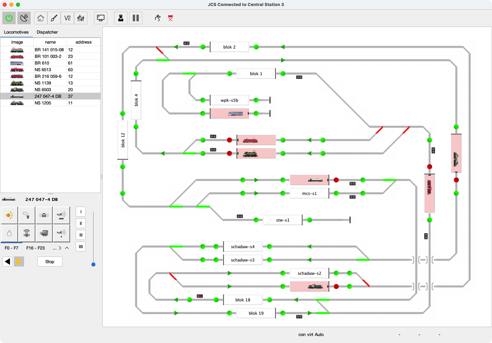

# Java Central Station

🌐 **[Lees deze README in het Nederlands](LEESMIJ.md)**

🎯 A hobby project to let your model trains run themselves — or drive them yourself, all in Java.

  

## 🚂 About

Java Central Station (JCS) is my personal passion project to bring a model railway to life with software.  
With JCS you can draw your layout, place trains on the tracks, and watch them move from block to block — either under your manual control or fully automated.  

I started this project out of curiosity (and fun!) to see how far I could take automation on a model railroad without relying on closed, commercial systems. Along the way, it has grown into a full tool that:

- Works with real hardware like DCC-EX, Märklin CS2/CS3, ESU ECoS, and HSI-S88.  
- Lets you run in Autopilot mode or drive manually with a Driver Cab.  
- Shows live sensor and switch feedback on your layout.  
- Includes a Virtual Command Station, so you can try things out even without hardware.  

The goal isn’t to compete with professional products, but to create something open, extendable, and fun — for anyone who loves tinkering with trains and code. 🚉✨

## 🎯 Why This Project?

Most commercial solutions for model railway automation feel like a **black box** — powerful, but closed, rigid, and sometimes overkill for (my) hobby layout(s).  

I started **JCS** because I wanted something different:  

- A project where I could **learn by building**.  
- A chance to **experiment freely** with new ideas.  
- And above all… to **have fun running trains**! 🚂✨  

By making JCS open source, I hope it can also inspire other hobbyists:  

- Tinkerers who want to peek under the hood.  
- Builders who want to extend it with their own features.  
- Or simply anyone looking for a free and flexible alternative for their layout.  

## ✨ Key Features

- **Connects to command stations**: Märklin CS2/CS3, ESU ECoS, DCC-EX, and HSI-S88.  
- **Draw your layout**: An interactive graphical editor to design your tracks, blocks, and sensors.  
- **Run trains automatically**: Let the Autopilot handle routing and block control.  
- **Or drive them yourself**: Use the built-in Throttle / Driver Cab for manual control.  
- **See what’s happening in real time**: Live feedback from sensors, switches, and blocks.  
- **Test without hardware**: A Virtual Command Station lets you experiment on screen.  
- **Remote visibility**: Built-in VNC viewer for Märklin CS3 and ESU ECoS systems.  

> Whether you want to hand the controls to Autopilot, or keep your hands on the throttle, JCS makes your layout comes alive.

---

## 🖼️ Screenshots

| Main Screen     |                        
|-----------------|
| | 

| Main Screen Edit Layout | Main Screen VNC |                         
|-----------------|-----------------|
| |  |

| Main Screen Automatic Driving |                         
|-----------------|
| | 

| Sensor Monitor | Manual Driver Throttle |                        
|-----------------|-----------------|
| |  |

| Accessory Settings | Locomotive Settings |
|-------------------|------------------|
|  |  |

| Driveway Settings | Driveway Commands |
|------------------|-----------------|
|  |  |

| Command Station Settings (CS3) |
|------------------|
|  | 

## ⚙️ Supported Command Stations

JCS supports a range of popular command stations for both commercial and DIY setups:

- **[Märklin CS-3](https://www.marklin.nl/producten/details/article/60216)**  
  Fully supported; allows full control of locomotives, turnouts, and accessories.

- **[Märklin CS-2](https://www.marklin.nl/producten/details/article/60215)** — [Protocol Documentation](http://streaming.maerklin.de/public-media/cs2/cs2CAN-Protokoll-2_0.pdf)  
  Supported via CAN bus; can be used for real-time feedback and manual driving.

- **[ESU ECoS](https://www.esu.eu/)** — [Protocol Documentation ESU](https://github.com/cbries/railessentials/blob/master/ecoslibNet48/Documentation/ecos_pc_interface3.pdf) — [Community Version](https://github.com/TabalugaDrache/TCPEcos/files/13458970/Netzwerkspezifikation_2023.pdf)  
  Supports TCP/IP connections; compatible with both commercial and community network protocols.

- **[DCC-EX](https://dcc-ex.com)**  
  Can be connected via serial port or network; provides full DCC control for locomotives, blocks, and accessories.

- **[HSI-S88](https://www.ldt-infocenter.com/dokuwiki/doku.php?id=en:hsi-88-usb)** — or the [DIY version](https://mobatron.4lima.de/2020/05/s88-scanner-mit-arduino)  
  Feedback module for sensor blocks; supports both official and DIY setups for detecting train occupancy.

## 🔧 Current Status & Roadmap

JCS is under active development! You can follow progress, report issues, or suggest features on the [GitHub Issues page](https://github.com/fransjacobs/model-railway/issues).  

Current focus areas:

- Improving documentation  
- Enhancing the GUI  
- Adding signal displays in automatic running  
- Internationalization (multi-language support)  
- Expanding unit tests  
- More hardware integrations  

## 🎮 Do You Want to Try It Yourself?

If you’d like to try JCS yourself, it would be greatly appreciated!  

Before you start, make sure your layout meets a few requirements:

- Each block must have **at least 2 feedback sensors**.  
- A **turnout (switch)** cannot be part of a block.  
- Your layout should contain **at least 2 blocks**.  

Once your layout is ready, you can start exploring Autopilot and manual control with the Driver Cab.

### 🛠 Prerequisites

Before running JCS, make sure you have:

- **Java 21** installed (e.g., [Temurin OpenJDK](https://adoptium.net/temurin/releases/))  
- A **supported command station** connected and configured (see [Supported Command Stations](#supported-command-stations))  

> Tip: Make sure your Java environment is properly set in your system PATH to run the application from the command line if needed.

### 💾 Download a Prebuilt Release

The latest stable version is **v0.0.2** (released September 27, 2024):  

- First fully automated driving version  
- Executables available for **Windows, macOS, Linux**, and a **cross-platform Uber-JAR bundle**  
- For full release notes and changelog, see the [Releases section](https://github.com/fransjacobs/model-railway/releases)  

> Tip: The Uber-JAR can be run directly with `java -jar jcs-uber.jar` without installing dependencies.

### 🏗 Build from Source

If you prefer to build JCS yourself:  

- See [BUILDING.md](BUILDING.md) for **full build instructions**, including required libraries, Maven commands, and troubleshooting tips.  
- Recommended for developers who want to **modify, extend, or debug** the application.  

### ⚙️ Setup and Usage

Get started quickly with JCS using the following resources:

- **Walkthrough**: [JCS_SETUP.md](JCS_SETUP.md) — Step-by-step instructions for getting your layout ready and starting the application.  
- **Driving and Automation Guide**: [DRIVING.md](DRIVING.md) — Learn how to operate trains manually or with Autopilot.  
- **Interface Documentation**: [INTERFACES.md](INTERFACES.md) — Detailed info on connecting command stations, sensors, and blocks.  

> Tip: Start with a small layout and a few trains to explore features before scaling up to larger setups.

## 🤝 Contribution

Contributions are **always welcome**! You can help by:

- Reporting bugs or issues on the [GitHub Issues page](https://github.com/fransjacobs/model-railway/issues)  
- Proposing new features or improvements  
- Submitting pull requests with fixes or enhancements  

Your input helps make JCS better for everyone.  

## 📄 License

This project is licensed under the **Apache-2.0 License**.  
See the [LICENSE](LICENSE) file for full details.  

## 🙌 Contributors

A big thank you to everyone supporting this project!  

<table>
<tr>
    <td align="center">
        <a href="https://github.com/fransjacobs">
            
             
            <b>Frans Jacobs</b>
        </a>
    </td>
    <td align="center">
        
         
        Support development and keep the trains running!
    </td>
</tr>
</table>

I hope this project inspires you to **experiment, tinker, and have fun with model railways and code!**  

— Frans

---

## 📜 Copyright 2019 - 2025 Frans Jacobs

Permission is hereby granted, free of charge, to any person obtaining a copy of this software and associated documentation files (the "Software"), to deal in the Software **without restriction**, including the rights to use, copy, modify, merge, publish, distribute, sublicense, and/or sell copies of the Software, and to permit persons to whom the Software is furnished to do so, subject to the following conditions:

The above copyright notice and this permission notice shall be included in all copies or substantial portions of the Software.

**THE SOFTWARE IS PROVIDED "AS IS", WITHOUT WARRANTY OF ANY KIND, EXPRESS OR IMPLIED**, including but not limited to the warranties of merchantability, fitness for a particular purpose, and non-infringement. In no event shall the authors or copyright holders be liable for any claim, damages, or other liability, whether in an action of contract, tort, or otherwise, arising from, out of, or in connection with the software or its use.

---

> Thank you for being part of the JCS community — every contribution, suggestion, or cup of coffee keeps this hobby project alive! 🚂✨
