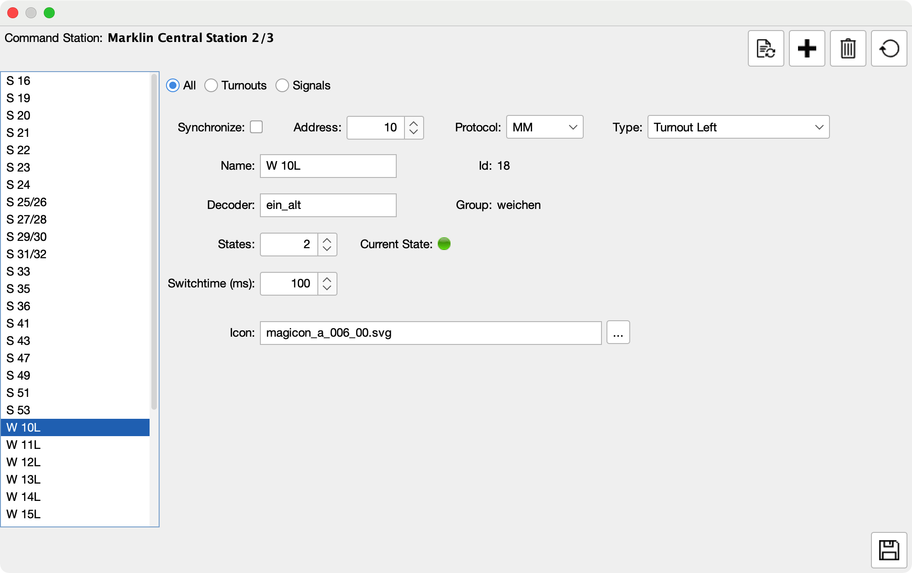

# Java Central Station

🎯 A hobby project to let your model trains run themselves — or drive them yourself, all in Java.

---

  
  
  
  
  
  
  
  
  

---

## 🚂 About JCS

Java Central Station (JCS) is my personal passion project to bring a model railway to life with software.  
With JCS you can draw your layout, place trains on the tracks, and watch them move from block to block — either under your manual control or fully automated.  

I started this project out of curiosity (and fun!) to see how far I could take automation on a model railroad without relying on closed, commercial systems. Along the way, it has grown into a full tool that:

- Works with real hardware like DCC-EX, Märklin CS2/CS3, ESU ECoS, and HSI-S88.  
- Lets you run in Autopilot mode or drive manually with a Driver Cab.  
- Shows live sensor and switch feedback on your layout.  
- Includes a Virtual Command Station, so you can try things out even without hardware.  

The goal isn’t to compete with professional products, but to create something open, extendable, and fun — for anyone who loves tinkering with trains and code. 🚉✨

---

## 🎯 Why This Project?

Most commercial solutions for model railway automation feel like a **black box** — powerful, but closed, rigid, and sometimes overkill for hobby layouts.  

I started **JCS** because I wanted something different:  

- A project where I could **learn by building**.  
- A chance to **experiment freely** with new ideas.  
- And above all… to **have fun running trains**! 🚂✨  

By making JCS open source, I hope it can also inspire other hobbyists:  

- Tinkerers who want to peek under the hood.  
- Builders who want to extend it with their own features.  
- Or simply anyone looking for a free and flexible alternative for their layout.  

---

## ✨ Key Features

- **Connects to command stations**: Märklin CS2/CS3, ESU ECoS, DCC-EX, and HSI-S88.  
- **Draw your layout**: An interactive graphical editor to design your tracks, blocks, and sensors.  
- **Run trains automatically**: Let the Autopilot handle routing and block control.  
- **Or drive them yourself**: Use the built-in Throttle / Driver Cab for manual control.  
- **See what’s happening in real time**: Live feedback from sensors, switches, and blocks.  
- **Test without hardware**: A Virtual Command Station lets you experiment on screen.  
- **Remote visibility**: Built-in VNC viewer for Märklin CS3 and ESU ECoS systems.  

> Whether you want to hand the controls to Autopilot, or keep your hands on the throttle, JCS makes your layout come alive.

---

## Screenshots & Demos

## 🖼️ Screenshots & Demos

| Main Screen     |                        
|-----------------|
| | 

| Main Screen Edit Layout | Main Screen VNC |                         
|-----------------|-----------------|
| |  |

| Main Screen Automatic Driving |                         
|-----------------|-----------------|
| | 

| Sensor Monitor | Manual Driver Throttle |                        
|-----------------|-----------------|
| |  |

| Accessory Settings | Locomotive Settings |
|-------------------|------------------|
|  |  |

| Driveway Settings | Driveway Commands |
|------------------|-----------------|
|  |  |

| Command Station Settings (CS3) |
|------------------|
|  | 

- **Throttle / Driver Cab**: Locomotive control interface  
- **Layout Editor & Autopilot**: Design your layout, place locomotives, and automate them  
- **Sensor Monitor**: View live track sensor data  
- **Keyboard Panel**: Manually toggle accessories or follow sensor inputs  
- **Preferences / Locomotive Import**: Import from Marklin CS2/3 or add icons manually  

---

## Supported Command Stations

- [Marklin CS-3](https://www.marklin.nl/producten/details/article/60216)  
- [Marklin CS-2](https://www.marklin.nl/producten/details/article/60215) — [Protocol Documentation](http://streaming.maerklin.de/public-media/cs2/cs2CAN-Protokoll-2_0.pdf)  
- [ESU ECoS](https://www.esu.eu/) — [Protocol Documentation ESU](https://github.com/cbries/railessentials/blob/master/ecoslibNet48/Documentation/ecos_pc_interface3.pdf) — [Community Version](https://github.com/TabalugaDrache/TCPEcos/files/13458970/Netzwerkspezifikation_2023.pdf)  
- [DCC-EX](https://dcc-ex.com) — can be connected either via serial port or network  
- [HSI-S88](https://www.ldt-infocenter.com/dokuwiki/doku.php?id=en:hsi-88-usb) — or the [DIY version](https://mobatron.4lima.de/2020/05/s88-scanner-mit-arduino)  

---

### Current Status & Roadmap

Under active development:  

- Improving documentation  
- Enhancing the GUI  
- Adding signal displays in automatic running  
- Internationalization (multi-language support)  
- Expanding unit tests  
- More hardware integrations  

---

## Getting Started

### Prerequisites

- Java 21 (e.g. Temurin OpenJDK)  
- A supported command station  

### Download a Prebuilt Release

The latest version is **v0.0.2** (released September 27, 2024):  

- First fully automated driving version  
- Included executables for Windows, macOS, Linux, and Uber-JAR bundle  
- See full changelog in the [Releases section](https://github.com/fransjacobs/model-railway/releases)  

### Build from Source

See [BUILDING.md](BUILDING.md) for full build instructions.

### Setup and Usage

- Walkthrough: [JCS_SETUP.md](JCS_SETUP.md)  
- Driving and automation guide: [DRIVING.md](DRIVING.md)  
- Interface documentation: [INTERFACES.md](INTERFACES.md)  

---

## Contribution

Contributions, bug reports, or general input are very welcome!  
Feel free to open issues, propose enhancements, or submit pull requests.

---

## License

Licensed under the Apache-2.0 License. See the [LICENSE](LICENSE) file for details.  

---

I hope you get inspired!  

Frans

## Contributors

<table>
<tr>
    <td align="center">
        <a href="https://github.com/fransjacobs">
            
             
            <b>Frans Jacobs</b>
        </a>
    </td>
    <td>
    </td>
</tr>
</table>

## Copyright 2019 - 2025 Frans Jacobs

Permission is hereby granted, free of charge, to any person obtaining a copy of this software and associated documentation files (the "Software"),
to deal in the Software without restriction, including without limitation the rights to use, copy, modify, merge, publish, distribute, sublicense,
and/or sell copies of the Software, and to permit persons to whom the Software is furnished to do so, subject to the following conditions:

The above copyright notice and this permission notice shall be included in all copies or substantial portions of the Software.

THE SOFTWARE IS PROVIDED "AS IS", WITHOUT WARRANTY OF ANY KIND, EXPRESS OR IMPLIED, INCLUDING BUT NOT LIMITED TO THE WARRANTIES OF MERCHANTABILITY,
FITNESS FOR A PARTICULAR PURPOSE AND NONINFRINGEMENT. IN NO EVENT SHALL THE AUTHORS OR COPYRIGHT HOLDERS BE LIABLE FOR ANY CLAIM, DAMAGES OR OTHER LIABILITY,
WHETHER IN AN ACTION OF CONTRACT, TORT OR OTHERWISE, ARISING FROM, OUT OF OR IN CONNECTION WITH THE SOFTWARE OR THE USE OR OTHER DEALINGS IN THE SOFTWARE.
