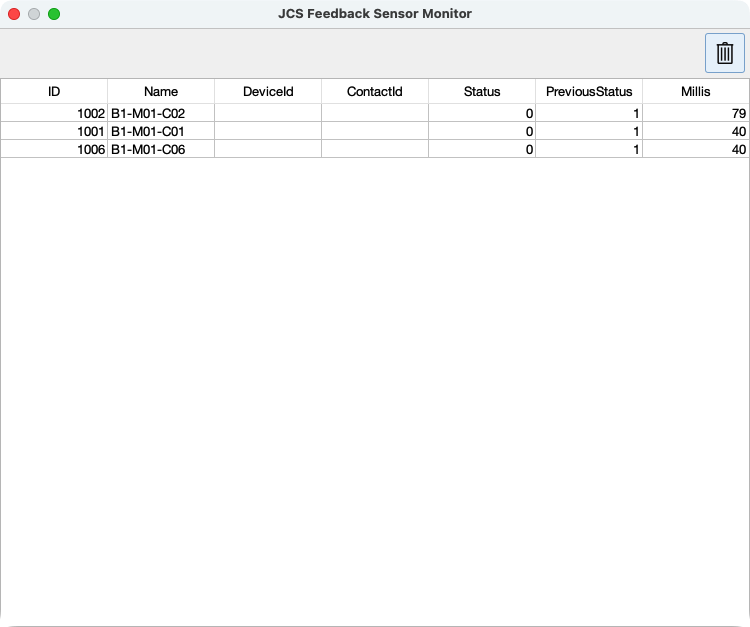

# Java Central Station (JCS)

*A hobbyist open-source project to automate model railways, written in Java.*

---

## 🚂 What is JCS?

JCS (Java Central Station) lets you design, control, and automate your model railway. With JCS you can:

- Draw and edit the layout (tracks, blocks, turnouts, sensors).  
- Place locomotives manually or via command stations and run them in *manual* or *autopilot* mode.  
- View live feedback: sensor events, switch (turnout) positions, block occupancy.  
- Simulate the system with a *Virtual Command Station* if you don’t yet have physical hardware.  
- Remote visibility via VNC for supported command stations.  

It’s built for hobbyists who like software, trains, and tinkering.

---

## 🎯 Why Build This?

Many commercial model railway automation tools are powerful but not open, or are restricted in flexibility. JCS is about:

- **Learning & experimentation**  
- **Open source**: free to use, inspect, modify  
- **Flexibility**: support for different hardware, and growing modularity  
- **Fun**: hobby projects don’t always need to be ultra polished—they should let you play, experiment, and learn

---

## ⚙️ Key Features

- Support for multiple command stations: **Märklin CS2/CS3**, **ESU ECoS**, **DCC‑EX**, **HSI‑S88**, etc.  
- Automatic train running via [**Autopilot**](./AUTOPILOT.MD)  
- Manual driving via *Throttle* or *Driver Cab*  
- Graphical layout editor and live sensor/block feedback  
- Virtual Command Station mode (no hardware required)  
- Dispatcher view, Cruise Control, turnout control  
- Multi-language support (NL/EN) in progress  

---

## 🤖 Autopilot — The Automatic Driving Engine

The **Autopilot** module allows fully automatic train operations once locomotives are placed in blocks with directions set.

- Each train gets its own **dispatcher**.
- Locomotives move block-by-block into **free** neighboring blocks.
- Sensors confirm **departure** and **arrival**.
- Autopilot marks blocks **free/occupied** dynamically to prevent collisions.
- Start one locomotive manually or all at once via **Cruise Control**.

➡️ See full details in [**AUTOPILOT.MD**](./AUTOPILOT.MD)  

---

## 🧰 Requirements

Before you run or build:

- **Java 21** (e.g., Temurin JDK or equivalent)  
- A supported command station or virtual mode setup  
- Layout must satisfy some constraints:
  - Each block has working feedback sensors  
  - Turnouts (switches) are *not* part of blocks  
  - At least two blocks (for meaningful autopilot behavior)  

---

## 🚀 Getting Started

### Try without hardware

1. Clone the repo  
2. Run in **Virtual Command Station** mode  
3. Use the layout editor to draw a simple layout  
4. Place a locomotive, set its direction, enable Autopilot or manual driving  

### Running with hardware

1. Ensure your command station is connected and configured  
2. Set up feedback sensors, blocks, turnouts, etc.  
3. Draw the layout in the layout editor  
4. Place trains, set directions  
5. Enable Autopilot or use manual Driver Cab  

---

## 🛠 Build & Installation

- Full build instructions are in **BUILDING.md**  
- Use Maven (or your IDE) to compile sources  
- A prebuilt JAR may be available via [Releases](https://github.com/fransjacobs/model-railway/releases)  

---

## 📊 Status & Roadmap

| Status | What works | In progress / Planned |
|---|---|---|
| ✅ Stable features | Layout editor, Autopilot, manual driving, CS2/CS3/ECoS support, sensor feedback | Signal displays in autopilot, GUI polish, unit tests |
| ⚠️ Work in progress | Internationalization, documentation, more command station backends | Multi-language UI, better styling & UX, enhanced autopilot decision logic |

---

## 🢂 Screenshots

### Main screen

### Layout editor

### Sensor monitor

### Locomotive Throttle

### Main screen VNC to Marklin CS-3

### Command Station settings for Marklin CS-3
 

---

## 🤝 Contributing

We welcome all kinds of contributions:

- Bug reports & issue suggestions  
- Feature requests & pull requests  
- Help with docs (especially translations)  
- Test writing  
- GUI / UX improvements  

Please follow the project’s conventions and open an issue to discuss large changes.

---

## 📄 License & Credits

This project is licensed under **Apache‑2.0**. See the [LICENSE](LICENSE) file for details.  

Thanks to all contributors, testers, and model railway enthusiasts who help make JCS better every day.  

---

*Frans Jacobs — 2019–2025*
